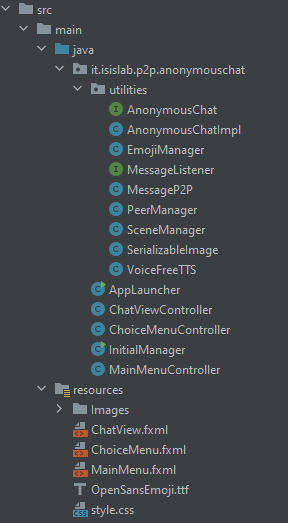

| AnonymousChat | Luca Postiglione | Architetture Distribuite per il Cloud |
| --- | --- | ---|  
     
     

# AnonymousChat: che cos'è?
Si tratta di una applicazione P2P che permette di unirsi o creare una o più chatroom in cui conversare, il tutto in maniera anonima.  

## Come è stato sviluppato
AnonymousChat è sviluppato con il linguaggio Java, facendo uso di Maven come tool di build automation. La rete P2P è realizzata usufrunedo della libreria/framework [TomP2P](https://tomp2p.net/): nello specifico essa mette a disposizione una **DHT** (Distributed Hash Table), ovvero una tabella hash distribuita, la quale funziona con la classica infrastruttura chiave-valore. Per rendere l'applicazione più *user-friendly* è stato utilizzato [OpenJFX](https://openjfx.io) (noto in passato come JavaFX), una piattaforma opensource per la realizzazione di applicazioni client su diversi sistemi: desktop, mobile ma anche embedded che si basano su Java.

## Idea
Il progetto è stato realizzato per il corso di Architetture Distribuite per il Cloud, un esame del secondo anno della magistrale di informatica all'Università degli Studi di Salerno, usando come modello di riferimento l'esempio del professor Carmine Spagnuolo sul [paradigma Publish/Subscribe](https://github.com/spagnuolocarmine/p2ppublishsubscribe).  
    
    
# Panoramica della soluzione

A ciascun progetto è stata fornita una *Java interface* con i metodi obbligatori da implementare. Nel caso specifico, le operazioni richieste sono le seguenti:
```java
public interface AnonymousChat {
    /**
     * Creates new room.
     * @param _room_name a String the name identify the public chat room.
     * @return true if the room is correctly created, false otherwise.
     */
    public boolean createRoom(String _room_name);
    /**
     * Joins in a public room.
     * @param _room_name the name identify the public chat room.
     * @return true if join success, false otherwise.
     */
    public boolean joinRoom(String _room_name);
    /**
     * Leaves in a public room.
     * @param _room_name the name identify the public chat room.
     * @return true if leave success, false otherwise.
     */
    public boolean leaveRoom(String _room_name);
    /**
     * Sends a string message to all members of a  a public room.
     * @param _room_name the name identify the public chat room.
     * @param _text_message a message String value.
     * @return true if send success, false otherwise.
     */
    public boolean sendMessage(String _room_name, String _text_message);
}
```

Di base la realizzazione di una chat distribuita non si discosta molto da quella della realizzazione del *paradigma Publish/Subscribe*, di conseguenza molto del focus è stato sull'aggiunta di proprietà, grafica e metodi aggiuntivi:  
- Non limitarsi ad un programma in esecuzione all'interno di un terminale, ma realizzare una interfaccia grafica per poter velocizzare/migliorare l'esperienza durante l'uso di **AnonymousChat**;  
  
  
- Permettere una corretta visualizzazione delle chat, permettendo all'utente di scegliere quale visualizzare, ma allo stesso tempo essere sempre aggiornato di nuovi messaggi giunti nelle altre;
- Possibilità di inviare un messaggio a tutte le chat di cui fa parte;
- Integrare il messaggio con emoji ed eventualmente allegare anche delle immagini;
    
  
# Struttura della soluzione
Il progetto ha la tipica struttura di un progetto Java basato su **OpenJFX**, quindi nella suddivisione in:
<div style="float:left;margin:0 10px;" markdown="1"> 
    
</div>  
 <div style="margin-left: 20%;">

- I Controller, ovvero classi Java che si occupano della gestione degli eventi di una GUI;
- Le Resources, componenti fondamentali della intefaccia grafica:
    - File FMXL, ovvero file scritti in FMXL, linguaggio di markup utilizzato per la definizione dell'interfaccia grafica per applicazioni JavaFX;
    - File CSS integrare la formattazione e lo stile alle interfacce definite nei file FXML;
    - Altre risorse (es. immagini, font, ecc...) come il logo o il font per visualizzare le emoji nelle componenti testuali;
- Altre classi Java, che definiscono gli elementi da utilizzare all'interno dei Controller;
</div>

Di seguito verrà spiegato un po' il codice delle classi principali presenti nel package **utilities**, poichè il core dell'applicazione risiede lì, mentre i Controller si occupano degli eventi quali "Ricevuto un messaggio, lo aggiungo nella chat opportuna, ed eventualmente notifico se la chat aperta è un'altra".  

## AnonymousChat 
I metodi della interfaccia "AnonymousChat" sono implementati in maniera pressoché identica a quelli del paradigma Publish/Subscribe, tranne per due cose. Prima di eseguire alcuna operazione sulla DHT, verifico se si fa parte di quella chat, in caso di invio messaggi o di left, o se l'utente cerca di joinare una chat di cui fa già parte. In più, il messaggio è l'istanza della mia classe **MessageP2P**, che spiegherò dopo. 
I metodi extra implementati sono:

 <div style="margin-left: 20%;">

- Invio di una immagine;
- Broadcast di un messaggio;

</div>
<br>
<br>

#

Il metodo *sendImage* praticamente identico al *sendMessage*, varia solo il costruttore utilizzato. All'invio della immagine si può anche allegare un messaggio di testo.
```java
public boolean sendImage(String _room_name, String _text_message, String imagePath)
    {
        try {

            //il controllo sulla chat
            if(!chatJoined.contains(_room_name)) return false;

            FutureGet futureGet = _dht.get(Number160.createHash(_room_name)).start();
            futureGet.awaitUninterruptibly();
            if (futureGet.isSuccess()) {
                HashSet<PeerAddress> peers_on_topic;
                peers_on_topic = (HashSet<PeerAddress>) futureGet.dataMap().values().iterator().next().object();

                for(PeerAddress peer:peers_on_topic)
                {
                    // Richiamo il costruttore che prevede un path
                    MessageP2P sms = new MessageP2P(_room_name, _text_message, imagePath);
                    FutureDirect futureDirect = _dht.peer().sendDirect(peer).object(sms).start();
                    futureDirect.awaitUninterruptibly();
                }

                return true;
            }
        }catch (Exception e) {
            e.printStackTrace();
        }
        return false;
    }
```
#
Per il *broadcast* di messaggi, usando l'**overloading**, espongo il metodo sia per messaggi normali che per invio di immagini.

```java
    public boolean broadcast(String _text_message){
      // Non posso fare broadcast se non partecipo ad alcuna chat
        if(chatJoined.size()==0) return false;

        for (String room: chatJoined)
            if(!sendMessage(room, _text_message)) return false;

        return true;
    }

    public boolean broadcast(String _text_message, String imagePath){
        if(chatJoined.size() == 0) return false;

        for (String room: chatJoined)
            if(!sendImage(room, _text_message, imagePath)) return false;

        return true;
    }

```
#
## MessageP2P
Rappresenta quello che è il messaggio che può essere inviato da un utente, che può contenere un messaggio testuale, una immagine o entrambe le cose.
Il campo relativo alla **chat** in cui è stato inviato è necessario in fase di ricezione per la visualizzazione del messaggio nella chatroom giusta.  

La classe è molto semplice, e non ha metodi particolari. L'immagine è un oggeto **SerializableImage**, una classe che ho implementato per realizzare la serializzazione delle immagini, poichè la classe **Image** di JFX non è serializzabile.

```java
public class MessageP2P implements Serializable {

    private String room;
    private String message;
    private SerializableImage image;

    public MessageP2P(){}

    public MessageP2P(String room, String message) {
        this.room = room;
        this.message = message;
    }

    public MessageP2P(String room, String message, String path) throws FileNotFoundException {
        this.room = room;
        this.message = message;
        setImage(path);
    }


    public void setImage(String path) throws FileNotFoundException {
        image = new SerializableImage();
        image.setImage(new Image(new FileInputStream(path)));

   // getter e setter
}
```

#
## SerializableImage

Questa classe permette di serializzare/deserializzare una *JFX Image*  decomponendola e ricomponendola utilizzando una matrice di interi, in cui il generico elemento [ i, j ] contiene un intero a 32 bit che definisce il colore del pixel [ i, j ]. Il tutto possibile per mezzo di una istanza della classe **PixelReader**, ottenibile dalla JFX Image stessa

```java
public class SerializableImage implements Serializable {
    private int width, height;
    private int[][] data;

    public SerializableImage() {}

    public void setImage(Image image) {
        width = ((int) image.getWidth());
        height = ((int) image.getHeight());
        data = new int[width][height];

        PixelReader r = image.getPixelReader();
        for (int i = 0; i < width; i++) {
            for (int j = 0; j < height; j++) {
                data[i][j] = r.getArgb(i, j);
            }
        }
    }

    public Image getImage() {
        WritableImage img = new WritableImage(width, height);
        PixelWriter w = img.getPixelWriter();

        for (int i = 0; i < width; i++) {
            for (int j = 0; j < height; j++ ) {
                w.setArgb(i, j, data[i][j]);
            }
        }
        return img;
    }
}
```

#
## PeerManager
Singleton per la gestione del *Peer*, compresa la gestione della ricezione del messaggio per mezzo di una **inner class**.  
Mantiene un riferimento ad una istanza di **AnonymousChat** per eseguire le varie operazioni ed una HashMap la quale ha come chiavi i nomi delle chatroom, e come valore un riferimento ad un oggetto della classe **TextFlow**, che è l'elemento grafico che rappresenta la chat.

Necessario l'uso di questo pattern per:
- Mantenere le informazioni del *Peer* nei cambi scena;
- La grafica permette la gestione di un solo peer per volta;

```java
public class PeerManager {

    class MessageListenerImpl implements MessageListener {
            //vedremo in seguito
    }

    private static PeerManager instance;
    private AnonymousChatImpl peer = null;

    static {
        try {
            instance = new PeerManager();
        } catch (Exception e) {
            throw new RuntimeException("An error occurred!", e);
        }
    }

    private int id = -1;
    private String master = null;

    private PeerManager() { }

    final private HashMap<String, TextFlow> chatJoined = new HashMap<>();

    public boolean init(int _id, String _master) throws Exception {
        if( id != -1  && master != null && peer != null) return false;
        id = _id;
        master = _master;
        peer = new AnonymousChatImpl(id, master, new MessageListenerImpl());

        return true;
    }

    public static PeerManager getInstance(){
        return instance;
    }

    public AnonymousChatImpl getPeer(){ return peer;}
    public HashMap getChat() { return chatJoined; }
    public void addChat(String roomName, TextFlow chat) { chatJoined.put(roomName, chat); }
    public boolean isChatJoined(String chatName){   return chatJoined.containsKey((chatName)); }
    public void removeChat(String roomName){ chatJoined.remove(roomName); }
}
```  
#
## MessageListener
Classe interna del *PeerManager* per la gestione della ricezione dei messaggi.
In primis, essendo la ricezione asincrona, mi devo assicurare di eseguire il tutto sul main thread, altrimenti JFX non mi permette di accedere alla UI. Alla ricezione del messaggio costruisco l'elemento da visualizzare:
- Verifico in quale chat inserire il messaggio
- Verifico la presenza di una immagine o meno nel messaggio;
- Aggiungo data e orario della ricezione;
- Inserisco un separatore tra un messaggio e il successivo;


```java
 class MessageListenerImpl implements MessageListener {

        public Object parseMessage(Object obj) {

            MessageP2P mss = (MessageP2P) obj;

            //Per modificare la UI devo lavorare su FX-main-thread
            Platform.runLater(() -> {

                TextFlow chat = chatJoined.get(mss.getRoom());
                Date date = new Date();
                SimpleDateFormat formatter = new SimpleDateFormat("dd MMMM, HH:mm");
                Text message = new Text("Sending Image\n");
                message.setFont(Font.font(20.0));

                if(!mss.getMessage().isBlank())
                    message.setText(mss.getMessage() + "\n");


                ImageView image = new ImageView();
                if(!(mss.getImage() == null))
                {
                    image.setImage(mss.getImage());
                    image.setFitHeight(100);
                    image.setPreserveRatio(true);
                }
                Label hour = new Label(formatter.format(date));
                hour.setPrefWidth(chat.getWidth() - 30.0);
                hour.setAlignment(Pos.CENTER_RIGHT);

                // Separatore tra messaggi
                final Separator separator = new Separator(Orientation.HORIZONTAL);
                separator.prefWidthProperty().bind(chat.widthProperty());
                separator.setStyle("-fx-background-color: #484848;");
                chat.getChildren().addAll(message, image, hour, separator);

            });

            return "success";
        }
    }
```  

# Testing: Unit test con JUnit5
## Struttura
Al fine di poter eseguire correttamente i test, in maniera indipendente da loro ordine di esecuzione, sono state utilizzate le annotazioni fornite da JUnit5.

**@BeforeAll** per eseguire una funziona prima dell'esecuzione di un qualunque test di quella classe di test. In questo caso mi serve per creare i peer.
```java
@BeforeAll
static void createPeers() throws Exception {
    assertDoesNotThrow(()->{p0 = new AnonymousChatImpl(0, "127.0.0.1", new MessageListenerImpl(0));});
    assertDoesNotThrow(()->{p1 = new AnonymousChatImpl(1, "127.0.0.1", new MessageListenerImpl(1));});
    assertDoesNotThrow(()->{p2 = new AnonymousChatImpl(2, "127.0.0.1", new MessageListenerImpl(2));});
    assertDoesNotThrow(()->{p3 = new AnonymousChatImpl(3, "127.0.0.1", new MessageListenerImpl(3));});
    
    //Tentativo di creare un peer con IP errato
    assertThrows(Exception.class, () -> {new AnonymousChatImpl(0, "127.0.0.2", new MessageListenerImpl(0));});
    receivedMessages[0] = new ArrayList<>();
    receivedMessages[1] = new ArrayList<>();
    receivedMessages[2] = new ArrayList<>();
    receivedMessages[3] = new ArrayList<>();
}
```  
**@AfterEach** e **@AfterAll** per eseguire funzioni, rispettivamente, dopo ogni test e alla fine di tutti i test. Nel mio caso dopo ogni test i peer devono abbandonare le chat, per evitare problemi o rallentamenti nei test di invio di messaggi, mentre ovviamente devono abbandonare la rete alla fine dei test.

```java
@AfterEach
public void leaveAll(){
    leaveChats(p0);
    leaveChats(p1);
    leaveChats(p2);
    leaveChats(p3);
}

@AfterAll
static void leaveNetwork() {
    assertTrue(p1.leaveNetwork(), "impossibile abbandonare la rete!");
    assertTrue(p2.leaveNetwork(), "impossibile abbandonare la rete!");
    assertTrue(p3.leaveNetwork(), "impossibile abbandonare la rete!");
    assertTrue(p0.leaveNetwork(), "impossibile abbandonare la rete!");
    assertEquals(0 , p0.getChatJoined().size());
    assertEquals(0 , p1.getChatJoined().size());
    assertEquals(0 , p2.getChatJoined().size());
    assertEquals(0 , p3.getChatJoined().size());
}
```
È stato necessario scrivere un listener per i messaggi ad hoc per il testing, che deve salvare i messaggi che i peer ricevono, al fine ti poter testare non solo il corretto invio, ma anche la corretta ricezione.
Poichè le operazioni di *send* e *receive* sono asincrone, ho dovuto far ricorso a *lock* e *condition*, affinchè un determinato peer non effettui test su ciò che ha ricevuto prima che efftivamente la ricezione di qualcosa sia avvenuta.  
Il *lock* usato è una istanza di **ReentrantLock**.

```java
static class MessageListenerImpl implements MessageListener
{
    int peer;
    public MessageListenerImpl(int peer){
        this.peer = peer;
    }

    @Override
    public Object parseMessage(Object obj) {
        try{
            lock.lock();
            receivedMessages[peer].add((MessageP2P) obj);
            condition.notify();
        }
        finally {
            lock.unlock();
        }

    return "success";
    }
}
```

## Esempio di Test: invio di una immagine
La struttura dei test è più o meno la stessa, di conseguenza verrà spiegata quella che si considera più completa, ovvero l'invio di una immagine.  

In primis in ogni test istanzio gli oggetti necessari al test case e analizzo i casi falsi, che nella maggior parte dei casi si riduce ad eseguire la funzione da testare in una stanza mai creata/joinata.
```java
@Test
void sendImageTest() throws InterruptedException {
    String r1 = "testSend";
    String imagePath1 = "testImages/testImage.png", imagePath2 = "testImages/testImage2.jpg";
    Image testImg1 = new Image(imagePath1);

    assertFalse(p0.sendImage(r1, "sms1", imagePath1), "messaggio inviato in una stanza mai creata!");

    p0.createRoom(r1);
    assertFalse(p0.sendImage(r1, "sms1", imagePath2), "messaggio inviato in una stanza in cui non partecipi!");

    p0.joinRoom(r1);
    p1.joinRoom(r1);
    p2.joinRoom(r1);

    //eliminazione di eventuali messaggi di altri test
    clearMessages();
```
#
Successivamente si procede con la corretta invocazione del metodo, avendo preparato tutto il necessario.  
I *test case* relativi a operazioni di invio messaggi sono stati progettati per verificare la corretta ricezione degli stessi, facendo uso del **lock & condition** introdotto in precedenza. 
Infatti in prima battuta mi assicuro di verificare che io abbia effettivamente ricevuto qualcosa, per poi verificare cosa ho ricevuto.
```java   
    assertTrue(p0.sendImage(r1, "sms1", imagePath1), "errore nell'inviare immagine");

    Image img0= null, img1 = null, img2 = null;
    String mss0 ="", mss1="", mss2="";

    try {
        lock.lock();
        while(receivedMessages[0].size() == 0) {  assertTrue(condition.await(5000, TimeUnit.MILLISECONDS)); }
        img0 = receivedMessages[0].get(0).getImage();
        mss0 = receivedMessages[0].get(0).getMessage();
    }
    finally {
        lock.unlock();    
    }

    try {
        lock.lock();
        while(receivedMessages[1].size() == 0){ assertTrue(condition.await(5000, TimeUnit.MILLISECONDS));}
        img1 = receivedMessages[1].get(0).getImage();
        mss1 = receivedMessages[1].get(0).getMessage();
    }
    finally {
        lock.unlock();
    }

    try {
        lock.lock();
        while(receivedMessages[2].size() == 0) { assertTrue(condition.await(5000, TimeUnit.MILLISECONDS));};
        img2 = receivedMessages[2].get(0).getImage();
        mss2 = receivedMessages[2].get(0).getMessage();
    }
    finally {
        lock.unlock();
    }
```
#
Infine si procede con verificare il contenuto di ciò che è stato ricevuto. Il messaggio testuale facilmente verificabile con una *assertEquals*, mentre per quanto riguarda le immagini ho implementato un metodo che ne va a verificare l'uguaglianza, che è verificata se:
1. Le due immagini hanno la stessa dimensione;
2. Corrispondenza dei colori di tutti i pixel che compongono le due immagini;
```java
    //---
    assertEquals("sms1", mss0, "errore ricezione messaggio peer0");
    assertEquals("sms1", mss1, "errore ricezione messaggio peer1");
    assertEquals("sms1", mss2, "errore ricezione messaggio peer2");
    assertTrue(assertEqualsImage(testImg1, img0), "errore ricezione immagine peer0");
    assertTrue(assertEqualsImage(testImg1, img1), "errore ricezione immagine peer1");
    assertTrue(assertEqualsImage(testImg1, img2), "errore ricezione immagine peer2");
   
}

private boolean assertEqualsImage(Image expected, Image current) {
    if(expected.getWidth() != current.getWidth() || expected.getHeight() != current.getHeight()) {
        return false;
    }

    int width  = (int) expected.getWidth();
    int height = (int) current.getHeight();

    PixelReader p1 = expected.getPixelReader();
    PixelReader p2 = expected.getPixelReader();

    for(int i = 0; i < height; i++) {
        for (int j = 0; j < width; j++)
            if (p1.getArgb(j, i) != p2.getArgb(j, i)) return false;
    }
    return true;
}
```


# AnonymousChat: esecuzione in Docker container
## Premesse
Per eseguire "AnonymousChat" (e in generale qualunque GUI) all'interno di un container bisogna setuppare l'host per la condivisione del **socket X11** con il container, installando una opportuna applicazione:
- su **Mac OS**:  installare [Xquartz](https://www.xquartz.org). Una volta fatto bisogna fare due cose:
   1.  Eseguirlo e andare nella sezione *Preferences > Security* e spuntare la voce *Allow connection from networks*;
   2.  Inserire nella whitelist l'ambiente locale & permettere l'accesso usando: *xhost +127.0.0.1* 
   Questo ultimo step va effettuato ad ogni lancio della applicazione *Xquartz*.

- su **Windows** (caso testato): molto più semplice, bisogna scaricare [VcXsrv Windows X Server](https://sourceforge.net/projects/vcxsrv/) e quando lo si esegue spuntare la voce *Disable access control* per permettere connessioni remote;

Al momento di eseguire il comando *docker run* bisogna settare il valore della variabile di ambiente **DISPLAY**, in cui settare l'host in cui eseguire ed eventualmente indicare schermi e display su cui eseguire. es:   
```
docker run -i --name MASTER-PEER -e DISPLAY=host.docker.internal:0.0  -e MASTERIP="127.0.0.1" -e ID=0 p2p-ac-client
```
In questo esempio si vuole eseguire su l'host locale e, non avendo a disposizione altri schermi o display, ho settato i valori 0.  
Credit di tale spiegazione e per maggiori informazioni si può consultare la guida che ho seguito: https://aboullaite.me/javafx-docker/
#
## Problematiche con Docker
Durante lo sviluppo di AnonymousChat, e nello specifico durante il testing delle funzionalità nel container, sono sorte problematiche:
- Quando viene lanciata la build dell'immagine, l'esecuzione di ``` mvn package ``` porta alla esecuzione dei test previsti nel deploy. In questa fase, non ho elementi che mi permettano di istanziare oggetti JFX, poichè impossibilitato ad istanziare un panel (anche se non visualizzato), di conseguenza ho dovuto lasciare come commento il case test dell'invio dell'immagine (che funziona correttamente nella versione locale);
- Impossibilità di utilizzare sistema di sintesi vocale (freeTTS) per accompagnare l'utente, o per eventuali notifiche/letture di messaggi;
- Problematiche di compatibilità con alcune schede Nvidia (quella da me utilizzata inclusa tra queste) che non permettono la corretta visualizzazione di menù a tendina o finestre pop-up per operazioni di conferma.

Nessuna parte di codice sopracitata è stata rimossa del tutto, quindi facilmente ripristinabile in locale.